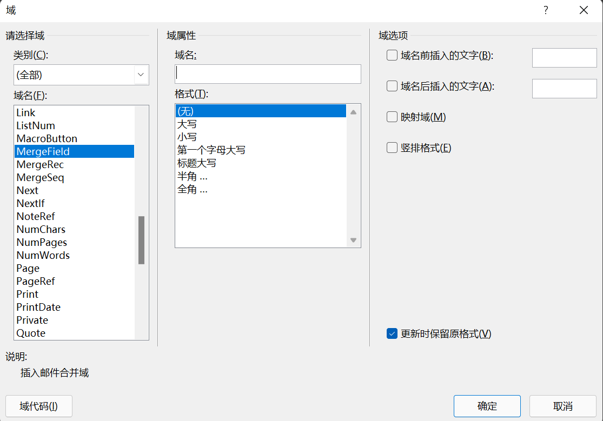

# 自动填充合同模板

### 创建合同模板

1. 获取word模板格式

2. 把光标放在在应当插入数据的空位，点击工具栏->插入->文档部件 ->域，选择Mergefield并填入合适的名称。

   

​	双尖括号之中的即为指定的域名，此操作在每一个需要自动填充的空位执行一次。

3. 保存word模板

### 创建数据表格

1. 创建excel文档，重命名表名。

2. 以图示方式填入数据，第一行代表的的列名不重要。

3. 以上图中 身份证号 列为例，若数据为纯数字，应将其转换为文本格式。右键该单元格->设置单元格格式，设为文本，即可。

   

### 脚本配置

1. 下载脚本中使用的包pip install。

2. 配置excel表名(上文中的“这是一个合同”)、模板文件位置、生成文件位置

3. 在循环体中，如下图：

   

   键名为模板文件中标明的域名，值为excel文件中第i行第j列的值。

4. 若使用相对路径报错，改用绝对路径或配置默认文件夹即可。

5. 在excel文件中添加的

6. 运行该脚本，如运行正常，将得到一份word文档及其导出的pdf文档。

7. 该脚本适用与批量导出使用通用模板的多个合同：在excel中添加数据行即可。