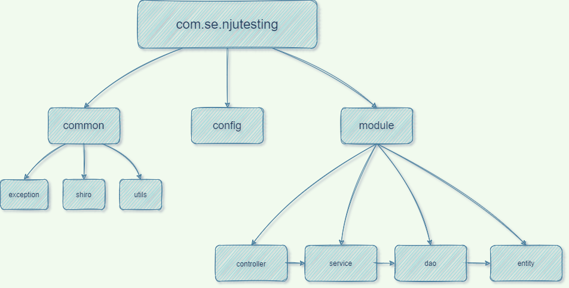

# 会议记录4.11

本周我们组内同学对接了项目概况，了解到基本框架已经搭建完毕，并且并且编写了基本的两个示例功能：登录认证授权、表单填写。

会议中我们定下下周目标：与测试中心工作人员联系，继续展开需求分析。技术方面以后端脚手架ruoyi为基础进行开发。

## 本周进展

### 实际工作与完成情况

| 序号 | 工作任务                                | 完成时间 | 完成人 | 完成情况                           |
| ---- | --------------------------------------- | -------- | ------ | ---------------------------------- |
| 1    | 搭建项目，引入必要依赖                  | 2022.4.3 | 秦嘉余 | 搭建项目完成，项目可运行           |
| 2    | 添加Shiro安全框架，并完成相关的配置编写 | 2022.4.4 | 秦嘉余 | 添加完成，可以实现基本功能         |
| 3    | 编写简单的用户登录功能测试              | 2022.4.5 | 赖烨文 | 编写完成，api可用                  |
| 4    | 编写基本的表单填写功能测试              | 2022.4.6 | 赖烨文 | 编写完成，api可用                  |
| 5    | 整合认证与授权功能到编写的测试接口上    | 2022.4.7 | 秦嘉余 | 整合后完成测试，认证与授权功能可用 |
| 6    | 成员学习项目所需技术                    | ...      | 全员   | 学习中                             |

### 项目结构介绍

#### 项目介绍

项目目前拥有common,config,module三个模块，主要业务在module中的controller和service之中。

框架结构图如下：

两个主要功能的流程图如下：

### 附录：模块功能介绍

### common

### exception

#### GlobalExceptionHandler

处理全局异常

### shiro

#### AccountRealm

AccountRealm是shiro进行登录或者权限校验的逻辑所在，需要重写3个方法，分别是：

supports：为了让realm支持jwt的凭证校验
doGetAuthorizationInfo：权限校验
doGetAuthenticationInfo：登录认证校验

#### JwtFilter

这个过滤器继承的是Shiro内置的AuthenticatingFilter，一个可以内置了可以自动登录方法的的过滤器。
我们需要重写几个方法：

createToken：实现登录，我们需要生成我们自定义支持的JwtToken
onAccessDenied：拦截校验，当头部没有Authorization时候，我们直接通过，不需要自动登录；当带有的时候，首先我们校验jwt的有效性，没问题我们就直接执行executeLogin方法实现自动登录
onLoginFailure：登录异常时候进入的方法，我们直接把异常信息封装然后抛出
preHandle：拦截器的前置拦截，因为我们是前后端分析项目，项目中除了需要跨域全局配置之外，我们再拦截器中也需要提供跨域支持。这样，拦截器才不会在进入Controller之前就被限制了。

#### JwtToken

继承AuthenticationToken

### utils

#### JwtUtils

读取yml配置信息，负责生成和解析JWT。

### Result

定义函数返回值结果类。

## config

### MongoConfig

屏蔽mongodb在插入时的多余属性_class。

### ShiroConfig

配置shiro。

引入RedisSessionDAO和RedisCacheManager，为了解决shiro的权限数据和会话信息能保存到redis中，实现会话共享。

重写了SessionManager和DefaultWebSecurityManager，同时在DefaultWebSecurityManager中为了关闭shiro自带的session方式，我们需要设置为false，这样用户就不再能通过session方式登录shiro。后面将采用jwt凭证登录。

在ShiroFilterChainDefinition中，我们不再通过编码形式拦截Controller访问路径，而是所有的路由都需要经过JwtFilter这个过滤器，然后判断请求头中是否含有jwt的信息，有就登录，没有就跳过。跳过之后，有Controller中的shiro注解进行再次拦截，比如@RequiresAuthentication，这样控制权限访问。

## module

### controller

#### ApplicationController

自动注入ApplicationService后，允许调用查询和插入的方法。

#### UserController

UserController自动注入JwtUtils用于JWT分发和验证，注入IUserService用于业务。

主要函数	

addUser（/add）：由shiro检查拥有权限后调用IUserService的插入新用户并返回结果。

 UserLogin（/login）：检测数据之后由JwtUtils生成Token并写入response头。

### entity

#### Application

合同表单

拥有测试类型，软件名称，版本等字段。

#### User

用户表

拥有id（主键），用户名，密码字段，与MySQL中属性和JavaBean中的属性进行一一映射。

### service

#### impl

##### ApplicationServiceImpl

实现类ApplicationServiceImpl继承ApplicationService接口，自动注入MongoTemplate，之后的增删改查调用MongoTemplate的方法完成。

##### UserServiceImpl

实现类UserServiceImpl继承IUserService接口，这个接口继承自于IService\<User>，这里的IService是mybatisplus中的接口，定义了一系列增删改查，它是对BaseMapper的扩展。除此之外，UserServiceImpl还继承了mybatisplus的实现类ServiceImpl，这个类也是接口IService的实现类，其中会自动注入一个BaseMapper类型的bean，也就是UserMapper的一个实例。

### Dao

#### UserMapper

接口UserMapper继承于mybatisplus中的接口BaseMapper,继承该接口后，无需编写 mapper.xml文件，即可获得CRUD功能，其实这时无需Service层已经具备操纵数据库的能力。