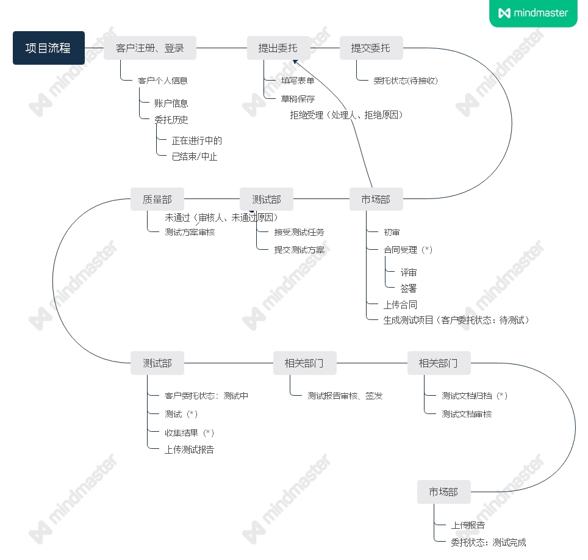

# 会议记录4.18

本周我组（后端B组）与前端组E组一起开展了测试中心网站项目需求分析，以在线会议的方式集中讨论了测试中心网站业务需求与测试委托办理的总体流程，针对网站管理员与客户所需的各项功能与委托办理的整体过程状态两个方面，我们经过讨论整理了在线管理的注册提出委托等各项功能场景，并对用户、客户、委托、合同、样品与报告等各个对象进行在线业务的功能分析，最终制作出详细的软件需求总结与完整的从注册登陆提交委托至测试完成客户收到报告这一整套测试中心业务委托流程图。

技术方面，调研选取了后端脚手架[YunaiV/ruoyi-vue-pro](https://github.com/YunaiV/ruoyi-vue-pro)，决定以此开发平台为基础，加速开发，目前学习该框架相关技术。

会议中，我们制定下周目标为进一步完善需求文档，尝试使用ruoyi进行开发。

### 附录（委托流程图）：

