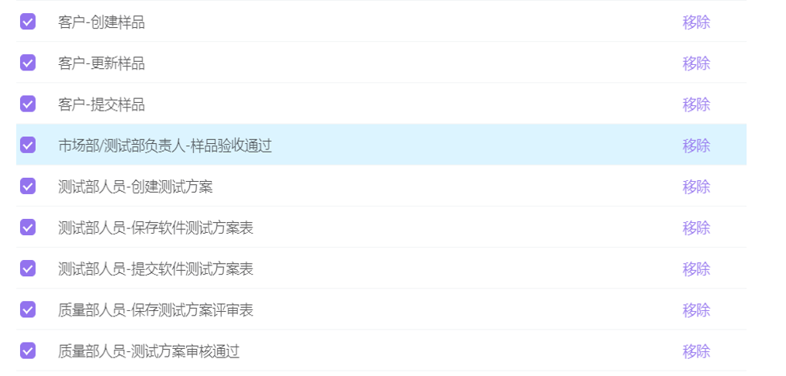
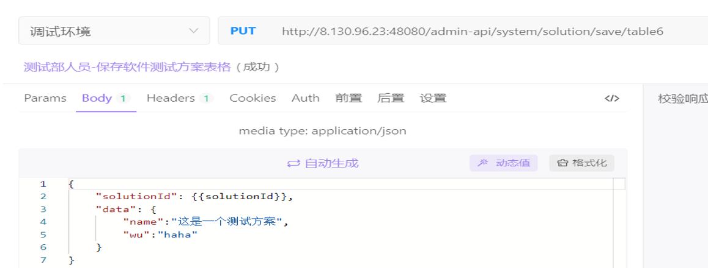
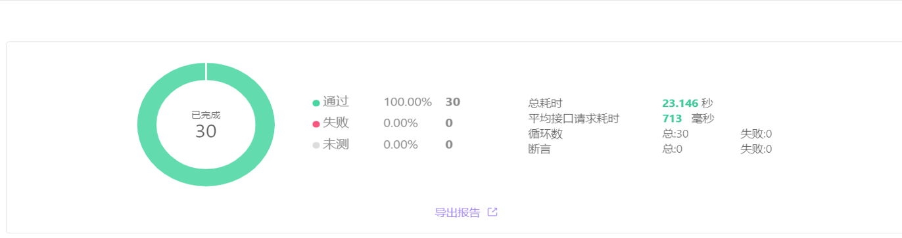
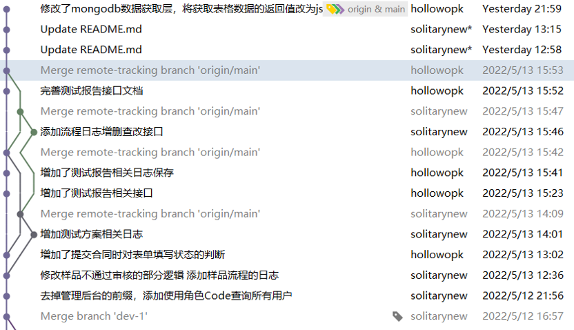

# 会议记录5.16

本周会议上大家一起分享了最终版流程图获得甲方认可与签字的好消息，并且交流了更加细化的相关接口，以及对于接口相关测试的结果。

我们决定下周开始同步开展项目测试，以及相关接口的编写。

## 本周进展

- 需求

  - 5.9最终版流程图上线！甲方已签字

- 技术：

  - 编写相关接口

    - 样品
      - 客户-创建样品、更新样品、提交样品
      - 工作人员-审核样品
    - 测试方案
      - 测试部人员-填写测试方案，提交测试方案
      - 质量部人员-审核测试方案，填写测试方案评审表
    - 测试报告：
      - 测试部人员-填写测试文档，提交测试文档
      - 测试部主管-审核测试文档
      - 授权签字人-签字

  - 按流程图对委托，合同，样品接口测试

    - Apifox测试套件

      

      

      

  - jenkins进行持续的软件版本发布

    - 使用Jenkins部署，代码仓库更新后自动部署，避免人工频繁打包重新部署

