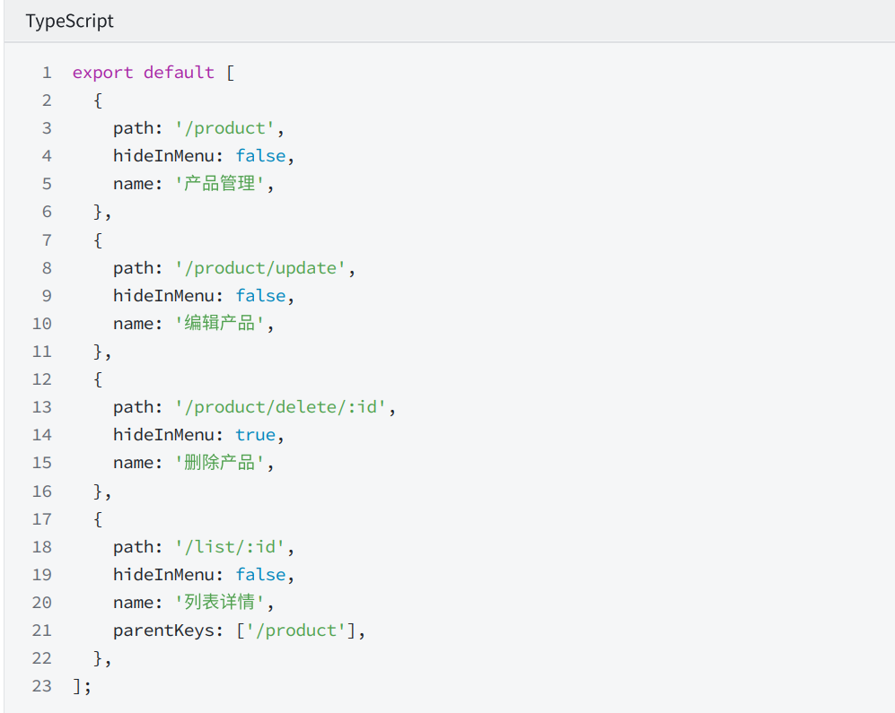
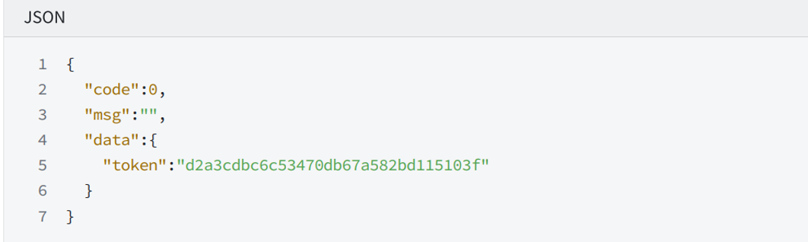
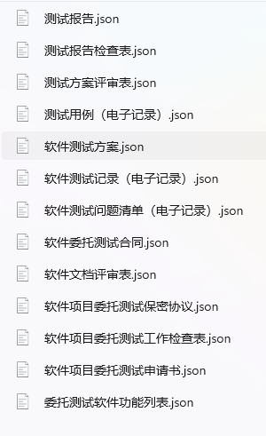

# 本周进展

- 需求

  - 数据表定义与生成（用户、委托、合同、样品等）

  - 与E组前端对接

    - RBAC模式进行权限管理（用户-角色-权限）

    - 建立角色树、功能树

      - 用户到角色树叶节点的多对多映射
      - 角色树叶节点到功能树子树的多对多映射
      - user：所有用户
      - role：所有角色（树形结构）
        - 查整体的角色树
        - 根据具体数据请求更新数据表
        - 根据用户查对应的角色树叶节点

      维护user-role的映射

      auth：所有功能权限（树形结构，叶节点对应页面或接口，非叶节点对应菜单

      查整体的功能树

      根据角色查对应的功能树子树

      维护role-auth的映射

    - 菜单数据格式

      

    - 认证和接口格式

      

  - 菜单组件生成:  `每周进展-B组-5.3.assets/菜单组件1.1.md`

- 技术

  - 技术表格json模板生成

    

  - 系统假设

    - 接入了MySQL云数据库，MongoDB云数据库
      - 数据统一，无需频繁使用sql脚本更新数据库
    - 短信平台
      - 验证码登录等
      - 还未充值，暂时使用钉钉机器人辅助测试
    - 文件配置，Minio
      - 本地测试

  - 存入暂定角色与菜单信息

  - 编写相关接口

    - 认证
      - 登录（账号密码，手机号密码，手机号验证码等）
      - 重置密码，获取菜单
    - 公司，公司客户关联
      - 后台：增删查改
      - 前台：公司认证（升级为客户）
    - 委托与流程
      - 后台：增删查改
      - 前台：创建委托申请，填写委托，查询委托等