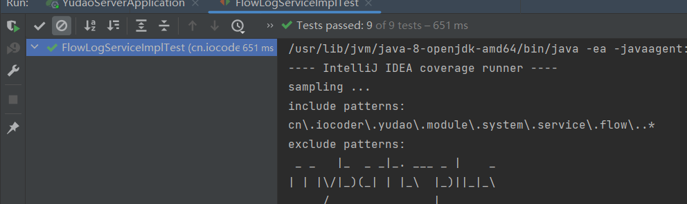
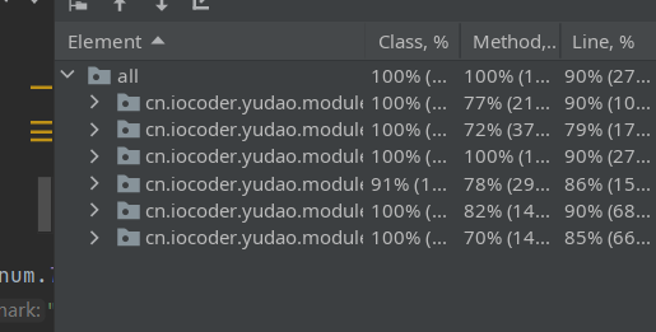
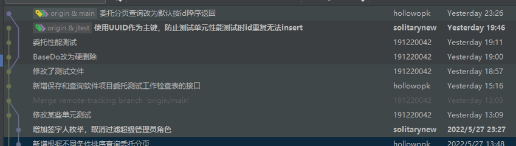

# 会议记录5.30

本周我们查看了新增的测试结果，发现效果很好，在与前端的对接中进一步将接口优化，并把此前项目的代码进一步优化，设计说明书等文档在持续编写中。并定下预期继续完善文档，等待最终的验收。

## 本周进展

- 技术

  - 编写单元测试

    - 用户管理、角色管理、权限管理、公司管理增删查改

      

      

  - 与前端对接

    - 修复部分有bug的接口
    - 修改部分接口返回值与参数，便于前端使用

  - 继续完善代码

- 文档编写中：

  - 设计说明书
  - 研发报告
  - 需求规格说明书
  - 测试报告

