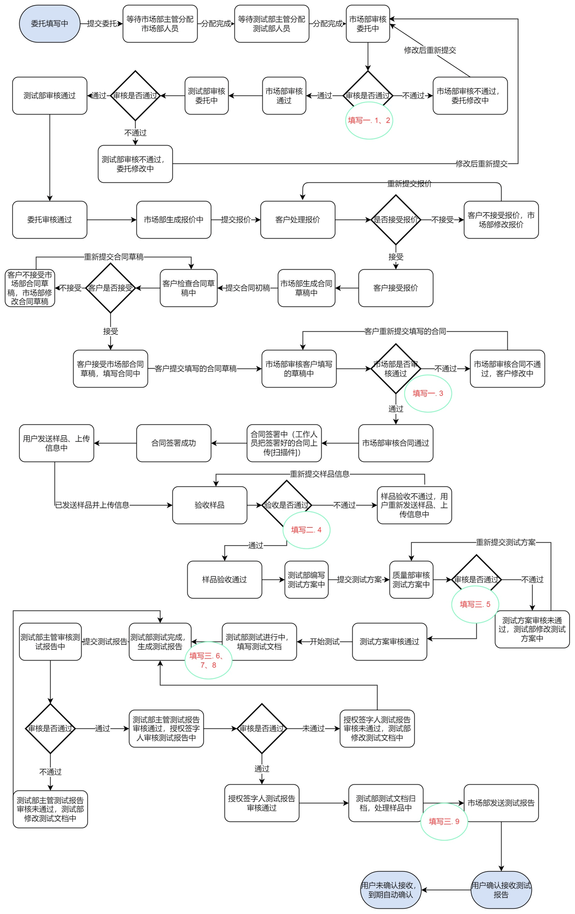

# 会议记录5.9

本周会议中，负责需求的同学向大家展示了进一步细化后的项目流程图，开发同学展示了修改优化后的数据表结构，最后大家一起制定了下周细化流程图，完善数据表结构优化此前demo的目标。

会议中制定下周目标为将编写好的项目流程图与测试中心老师确认，开发上进一步编写相关接口，按流程图对于委托、合同等接口进行测试。

## 本周进展

- 需求

  - 流程细化

    

- 技术

  - 数据表结构修改
    - 委托：
      - 市场部、测试部两重审核
      - 报价单
      - 文档评审表
    - 合同：
      - 市场部人员编写合同草稿
    - 测试方案：
      - 测试方案评审表
    - 测试报告：
      - 测试部主管
      - 授权签字人
  - 代码优化
    - 委托：
      - 两重审核
      - 报价单
      - 文档评审表
    - 合同
      - 双方签订
      - 上传电子文档
    - 数据表及业务流程重构程度较大，未完全编写完毕