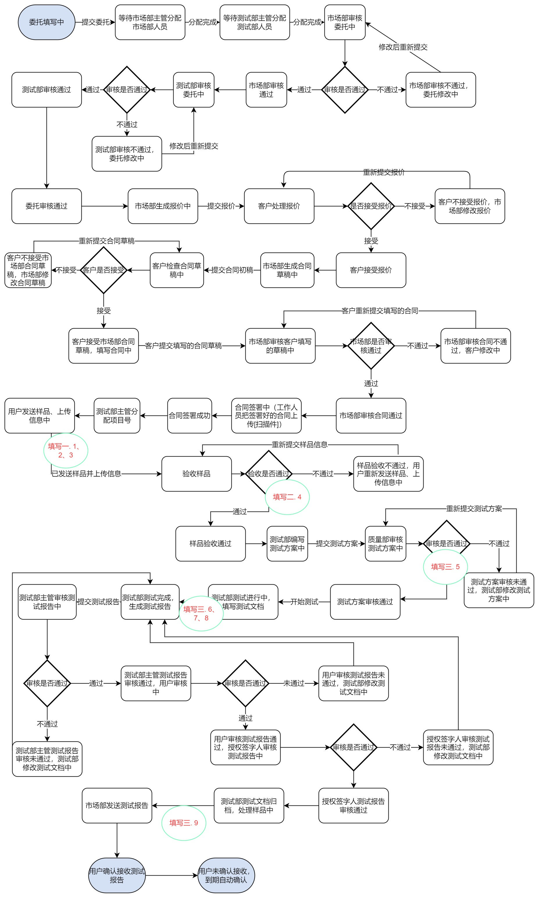

[TOC]

# “南大测试”在线管理平台需求分析

## 一、引言

### 1.1 目的

​		a.编写本文档的目的在于详细、准确和全面地定义“南大测试”在线管理平台的功能和用户需求，用以指导系统顺利地进行开发，并保证后续开发能够保质保量地完成。本文档所描述的需求信息将作为该项目最终验收的标准和依据。

​		b.本文档的预期读者有开发人员、客户、各部门（市场部、测试部、质量部等）工作人员和系统管理人员

### 1.2 背景

​		待开发的软件系统名称为“南大测试”在线管理平台，形式是web应用，本项目的任务提出者是南京大学软件测试中心市场部高级管理人员曹春老师，开发成员为后端六人——秦嘉余、蒋梓栩、赖烨文、刘永鹏、孙文戈、张城铨，对接前端组——何健平、曾庆扬、刘东旭、苏晨阳、张嘉麒；用户包括提出测试委托申请的客户、南京大学软件测试中心的工作人员。本软件系统服务于南京大学软件测试中心。

### 1.3 定义、缩写词、略语

​		a. 用户：本平台的使用者，包括客户、工作人员等

​		b. 客户：在本凭条上提交了测试委托的用户

​		c. web应用：用户基于web浏览器访问的应用程序

​		d. 工作人员：测试中心的工作人员，主要部门包括：市场部、测试部、质量部

### 1.4 参考资料

[1] GB/T 8567-2006 《计算机软件文档编制规范》

[2] GB/T 25000.10-2016 《系统与软件工程系统与软件质量要求和评（SQuaRE）第 10 部分：系统与软件质量模型》

[3] GB/T 25000.51-2016 《系统与软件工程系统与软件质量要求和评（SQuaRE）第 51 部分：就绪可用软件产品（RUSP）的质量要求和测试细则》

## 二、项目概述

### 2.1 用例图和产品描述

#### 2.1.1 目标概述

​		该软件系统用来实现“南大测试”在线管理平台的服务，主要流程如下：

1. 用户注册
2. 用户登录
3. （用户需要完成公司认证后才能发起委托）用户发起委托(上传相关文档，用户手册等) 
4. 市场部审核委托 （市场部主管分配给具体工作人员）
5. 测试部审核委托（测试部主管分配给具体工作人员） 
6. 市场部提出报价
7. 用户接受报价 
8. 用户不接收受报价，市场部修改后重新提交
9. 市场部起草合同草稿 
10. 市场部和用户修改确认合同草稿
11. 测试部主管为该委托分配项目编号（2022.6.6新增）
12. 用户上传样品信息 
13. 测试部**或**市场部验收样品，主要是检查样品实体和用户上传的信息、发起委托时提交的文档是否符合 
14. 测试部编写测试方案 
15. 质量部**任意一个人**审核测试方案 
16. 测试部进行测试，填写测试文档 
17. 测试部主管审核测试报告 
18. 用户审核测试报告
19. **授权签字人**批准发布报告(《测试报告检查表》) {授权签字人是**经过后台授权**的特定人物，一般是某个部门的主管，但任意部门的主管不一定是授权签字人} 
20. 测试部归档（后台对此次测试的过程信息归档，比如样品源代码(如果有的话)，测试样例等[大致可以认为是测试过程中填的那些测试文档]） 
21. 市场部发布报告给用户 
22. 用户确认（如果一直没确认过段时间会自动确认）

### 2.2 用户特点

| 用户类型   | 用户特点                                                     |
| ---------- | ------------------------------------------------------------ |
| 客户       | 互联网公司人员，有软件测试业务需求                           |
| 工作人员   | 按部门分类包括：测试部、市场部、质量部等，具有不同的审核、与用户对接等任务，有良好的计算机操作技术和业务能力 |
| 系统管理员 | 高校教师，具有管理员权限和所有的菜单权限，可以赋权“授权签字人” |

### 2.3 假设和约束

1. 开发截止日期：2022 年 7 月 18 日，即课程结束日。
2. 在开发中，开发者要提交软件需求规格说明文档、设计描述文档和测试报告；
3. 开发环境：Windows 10，IntelliJ IDEA，PyCharm，MySQL 数据库，MongoDB数据库。

## 三、需求规定

### 3.1 功能需求概述

南大测试在线管理系统实现“南大测试”线上流程管理的服务，主要功能包括：

#### 3.1.1 管理视角

- 用户管理：注册与维护用户、用户身份认证、用户授权
- 客户管理：客户认证、客户关系管理（CRM）、客户查询
- 委托管理：在线委托、在线受理与审批、项目建立与查询
- 合同管理：合同创建、修改、删除、评审、查询等管理
- 样品管理：样品接收、归还、归档、销毁、查询
- 报告管理：报告编制、复核、批准、查询等管理
- 测试项目管理：
  - 文档管理
  - 测试文档管理（测试方案、测试用例、测试记录、问题清单）
  - 测试报告管理（报告编制、复核、形式检查、批准、查询等管理）
  - 测试报告生成（从原始数据生产正式文档）

#### 3.1.2 用户视角

### 3.2 功能需求描述

#### 3.2.1 功能流程图

#### 3.2.2 具体功能与用例表

##### 3.2.2.1 用户注册

- 用户注册模块需要维护用户-web-数据库的交互
- 已注册过的用户名/手机号/邮箱无法重复注册
- 用户注册成功后需要通过公司认证后才能成为客户(被授权可以发起委托)

| 用例名称 | 用户注册                                                     |
| -------- | ------------------------------------------------------------ |
| 主体对象 | 用户                                                         |
| 触发条件 |                                                              |
| 前置条件 | 对应用户名称、邮箱、电话均未注册过                           |
| 工作流程 | 1. 用户点击“注册”按钮 2. 用户填写用户名称、密码、邮箱、电话 3.用户点击“获取验证码”按钮 4.用户填写收到的验证码 5. 用户点击“确认注册”按钮 6. 用户收到注册失败的提示 7. 用户收到注册成功的提示 |
| 后置条件 | 用户注册成功                                                 |

##### 3.2.2.2 用户登录

- 用户登录需要输入正确的用户名/手机号/邮箱和密码
- 后续功能: 用户忘记密码可以使用手机验证码登录

| 用例名称 | 用户登录                                                     |
| -------- | ------------------------------------------------------------ |
| 主体对象 | 用户                                                         |
| 触发条件 |                                                              |
| 前置条件 | 对应用户名称/邮箱/电话已经注册过                             |
| 工作流程 | 1. 用户选择登录方式（用户名/邮箱/电话号码/电话号码验证码） 2. 用户填写用户名称/邮箱/电话和密码/验证码 3.用户点击“登录”按钮 4. 用户收到登录失败的提示 5. 用户收到登录成功的提示 |
| 后置条件 | 用户登录成功                                                 |

##### 3.2.2.3 用户认证

- 该功能适用于尚未通过公司认证的普通用户
- 用户认证分为 用户发起认证申请、主管分配审核任务、工作人员审核、用户填写认证码 几个模块
- 用户认证需要用户提供公司名, 公司地址等公司信息
- 发出申请后市场部主管会收到该申请, 并分配该申请的审核任务给某一具体市场部工作人员
- 收到任务的市场部工作人员将处理这次认证申请
- 若通过该申请, 市场部工作人员将发送一个认证码给用户(微信或短信形式, 与本平台无关), 用户需要在平台上填写相应的认证码, 填写正确后, 用户将获得发起委托的权限

| 用例名称 | 发起认证申请                                                 |
| -------- | ------------------------------------------------------------ |
| 主体对象 | 用户                                                         |
| 触发条件 |                                                              |
| 前置条件 | 对应用户名称/邮箱/电话已经注册过，且用户还未认证过           |
| 工作流程 | 1. 用户点击“用户管理/我的账号信息/公司认证"按钮,进入公司认证页面 2. 用户填写公司名称, 地址等信息并提交  |
| 后置条件 | 市场部会收到新的认证申请                                     |

| 用例名称 | 分配审核认证                                                 |
| -------- | ------------------------------------------------------------ |
| 主体对象 | 市场部主管                                                   |
| 触发条件 | 市场部主管点击"认证管理"                                     |
| 前置条件 |                                                              |
| 工作流程 | 1. 市场部主管点击"认证管理/查看认证申请", 页面上显示出所有的公司认证申请 2. 市场部主管可以点击"认证管理/查看认证申请/查看"按钮查看具体某条认证申请 3. 可以点击"认证管理/分配认证申请审核任务"菜单, 页面上显示待审核的公司认证申请; 点击"查看"按钮可以查看具体某条申请, 点击"分配任务“按钮，显示出一系列工作人员名字，点击其中一个并确认可以分配该申请的审核任务给该工作人员 |
| 后置条件 | 某个工作人员会收到新的审核任务                               |

| 用例名称 | 审批认证                                                     |
| -------- | ------------------------------------------------------------ |
| 主体对象 | 市场部工作人员                                               |
| 触发条件 | 市场部工作人员点击"认证管理"                                 |
| 前置条件 |                                                              |
| 工作流程 | 1. 市场部工作人员点击"认证管理/查看认证申请", 页面上显示出所有自己负责的的公司认证申请 2. 市场部主管可以点击"认证管理/查看认证申请/查看"按钮查看具体某条认证申请 3. 可以点击"认证管理/查看认证申请/审批"按钮，进入认证申请审批界面 |
| 后置条件 | 若审批通过，工作人员会在后台数据库里添加该公司，并生成一个认证码给用户；若不通过，用户会收到提醒 |

| 用例名称 | 填写认证码                                                   |
| -------- | ------------------------------------------------------------ |
| 主体对象 | 用户                                                         |
| 触发条件 | 用户点击“认证管理/输入认证码”菜单                            |
| 前置条件 |                                                              |
| 工作流程 | 1. 用户点击“认证管理/输入认证码”菜单, 页面上会显示一个认证码的输入框 2. 用户输入收到的认证码并提交  |
| 后置条件 | 若认证码正确，认证成功，用户绑定上认证码对应的公司，并被授权可以发起委托；若不正确，认证失败 |

##### 3.2.2.4 发起委托

- 发起委托功能涉及到用户, 平台, 后台数据库, MongoDB数据库, 市场部主管, 测试部主管
- 用户须要通过公司认证才能发起委托
- 发起委托需要填写《软件项目委托测试申请表》、《委托测试软件功能列表》, 并上传待测试软件的相关文档(用户手册等)
- 用户可以随时保存当前正在填写的内容, 并选择下次在"我的委托"中进行修改或添加内容
- 待须填内容都填写完毕后, 用户才可以提交委托申请, 市场部主管和测试部主管都将收到该委托的审核任务

| 用例名称         | 发起委托                                                     |
| ---------------- | ------------------------------------------------------------ |
| 主体对象         | 用户                                                         |
| 触发条件         | 用户点击“发起委托”按钮                                       |
| 前置条件         | 用户具有发起委托权限                                         |
| 工作流程         | 1. 用户点击“发起委托"按钮，页面展示出两张在线填写的表格《软件项目委托测试申请表》、《委托测试软件功能列表》（是否还有相关文件上传入口，如用户手册等） 2. 填写《软件项目委托测试申请表》、《委托测试软件功能列表》 3. 填写完毕，用户点击提交按钮；或未填写完毕，用户点击暂存按钮 |
| 后置条件         | 委托表中新增一条目，委托相关表单的草稿保存到后台数据库       |
| 涉及到的技术表格 | NST－04－JS001－2018《软件项目委托测试提交材料》 （客户不用填） NST－04－JS002－2018《软件项目委托测试申请表》 NST－04－JS003－2018《委托测试软件功能列表》 |

##### 3.2.2.5 查看/修改我的委托

| 用例名称         | 查看/修改我的委托                                            |
| ---------------- | ------------------------------------------------------------ |
| 主体对象         | 用户                                                         |
| 触发条件         | 用户点击“委托管理/我的委托”按钮                              |
| 前置条件         | 用户已登录                                                   |
| 工作流程         | 1. 用户点击“委托管理/我的委托”按钮），页面上会展示该用户发起过的所有委托 2. 可以查看所有发起过的委托[每个委托下都有一个“查看”按钮]（在线显示两张表，以及上传过的文档？） 3. 什么样的委托可以修改？ （还未提交的委托[下面有一个“修改”按钮，重新进入委托申请页面<两张表、上传文档？>]、合同签订好的委托一定不能修改、已经提交但还未签订合同的委托是否可以修改？） |
| 后置条件         | 委托相关表单的草稿保存到后台数据库，如果提交，那么委托表中对应的条目需要更新（状态） |
| 涉及到的技术表格 | NST－04－JS001－2018《软件项目委托测试提交材料》 （用户不用填） NST－04－JS002－2018《软件项目委托测试申请表》 NST－04－JS003－2018《委托测试软件功能列表》 |

##### 3.2.2.6 委托审核

- 委托审核涉及到市场部主管, 测试部主管, 市场部工作人员, 测试部工作人员, 平台, 后台数据库, MongoDB数据库, 用户
- 委托审核分为主管分配委托审核、工作人员委托审核两部分
- 市场部主管分配审核任务到具体工作人员, 测试部主管分配审核任务到具体工作人员
- 只有市场部工作人员审核委托申请通过后, 测试部工作人员才会开始审核该委托
- 若市场部审核未通过, 将打回给用户重新提交委托申请, 流程同用户发起委托模块
- 若测试部审核未通过, 将打回给用户重新提交委托申请, 流程同用户发起委托模块, 重新提交后的委托申请由测试部重新审核(市场部无需再审核)
- 两部都审核通过后, 委托进入等待报价状态, 市场部工作人员将收到需要发起报价的通知

| 用例名称         | 分配委托审核                                                 |
| ---------------- | ------------------------------------------------------------ |
| 主体对象         | 市场部主管                                                   |
| 触发条件         | 市场部主管点击“委托管理/分配审核委托申请任务”按钮            |
| 前置条件         |                                                              |
| 工作流程         | 1. 市场部主管点击“委托管理/委培审核委托申请任务”按钮），页面上会展示所有待审核且没有被分配给具体市场部工作人员的委托 2. 可以点击某一委托下的“查看”按钮查看委托具体信息 3. 点击某一个委托下的“分配”按钮，页面上会显示一系列市场部工作人员的名字 4.点击要分配给的工作人员名字，确认分配 |
| 后置条件         | 委托表中对应的条目更新（状态），工作人员收到新任务的消息     |
| 涉及到的技术表格 | NST－04－JS002－2018《软件项目委托测试申请表》（用户提交过来的） NST－04－JS003－2018《委托测试软件功能列表》（用户提交过来的） NST－04－JS014－2011《软件文档评审表》（审核的人填） |

| 用例名称         | 委托审核                                                     |
| ---------------- | ------------------------------------------------------------ |
| 主体对象         | 市场部工作人员                                               |
| 触发条件         | 市场部工作人员点击“委托管理/查看委托”按钮                    |
| 前置条件         | 相应委托处于“待审核”状态                                     |
| 工作流程         | 1. 市场部工作人员点击“委托管理/查看委托”按钮，页面上会展示所有分配给自己的委托 2. 可以点击某一委托下的“查看”按钮查看委托具体信息 3. 点击某一个委托下的“审核”按钮，进入审核页面 4. 通过/不通过 |
| 后置条件         | 委托表中对应的条目更新（状态）                               |
| 涉及到的技术表格 | NST－04－JS002－2018《软件项目委托测试申请表》（用户提交过来的） NST－04－JS003－2018《委托测试软件功能列表》（用户提交过来的） NST－04－JS014－2011《软件文档评审表》（审核的人填） |

| 用例名称         | 分配委托审核                                                 |
| ---------------- | ------------------------------------------------------------ |
| 主体对象         | 测试部主管                                                   |
| 触发条件         | 测试部主管点击“委托管理/分配审核委托申请任务”按钮            |
| 前置条件         |                                                              |
| 工作流程         | 1. 测试部主管点击“委托管理/委培审核委托申请任务”按钮），页面上会展示所有待审核且没有被分配给具体测试部工作人员的委托 2. 可以点击某一委托下的“查看”按钮查看委托具体信息 3. 点击某一个委托下的“分配”按钮，页面上会显示一系列测试部工作人员的名字 4.点击要分配给的工作人员名字，确认分配 |
| 后置条件         | 委托表中对应的条目更新（状态），工作人员收到新任务的消息     |
| 涉及到的技术表格 | NST－04－JS002－2018《软件项目委托测试申请表》（用户提交过来的） NST－04－JS003－2018《委托测试软件功能列表》（用户提交过来的） NST－04－JS014－2011《软件文档评审表》（审核的人填） |

| 用例名称         | 委托审核                                                     |
| ---------------- | ------------------------------------------------------------ |
| 主体对象         | 测试部工作人员                                               |
| 触发条件         | 测试部工作人员点击“委托管理/查看委托”按钮                    |
| 前置条件         | 相应委托处于“待审核”状态                                     |
| 工作流程         | 1. 测试部工作人员点击“委托管理/查看委托”按钮，页面上会展示所有分配给自己的委托 2. 可以点击某一委托下的“查看”按钮查看委托具体信息 3. 点击某一个委托下的“审核”按钮，进入审核页面 4. 通过/不通过 |
| 后置条件         | 委托表中对应的条目更新（状态）                               |
| 涉及到的技术表格 | NST－04－JS002－2018《软件项目委托测试申请表》（用户提交过来的） NST－04－JS003－2018《委托测试软件功能列表》（用户提交过来的） NST－04－JS014－2011《软件文档评审表》（审核的人填） |

##### 3.2.2.7 报价

- 报价涉及到市场部工作人员、客户、平台、MongoDB数据库和后台数据库
- 市场部工作人员生成报价后提交给客户，客户选择是否接受
- 若接受，市场部工作人员进入拟定合同阶段
- 若不接受，市场部工作人员需要和客户协商后修改报价重新提交

| 用例名称         | 报价（市场部）                                               |
| ---------------- | ------------------------------------------------------------ |
| 主体对象         | 市场部工作人员                                               |
| 触发条件         | 市场部工作人员点击“委托管理/查看委托”按钮                    |
| 前置条件         | 相应委托已审核通过，处于“待报价”状态                         |
| 工作流程         | 1. 市场部工作人员点击“委托管理/查看委托”按钮，页面上会展示所有分配给自己的委托 2. 可以点击某一委托下的“查看”按钮查看委托具体信息 3. 点击某一个委托下的“上传报价”按钮，上传一个报价初稿（该委托必须处于还未上传报价的状态下） 4. 或是点击“修改”报价（该委托必须是已经上传过了报价初稿），进入上一次编辑的报价界面 5. 提交报价**初稿**后，用户会收到，并进行线下协商 |
| 后置条件         | 委托表中对应的条目更新（状态），用户收到新报价提醒           |
| 涉及到的技术表格 | 报价单                                                       |

| 用例名称         | 报价（用户）                                                 |
| ---------------- | ------------------------------------------------------------ |
| 主体对象         | 用户                                                         |
| 触发条件         | 用户点击“委托管理/我的委托”按钮                              |
| 前置条件         | 市场部工作人员针对该用户的某个委托提出了报价                 |
| 工作流程         | 1. 用户点击“委托管理/我的委托”按钮，页面上会展示所有自己发起的委托 2. 可以点击某一委托下的“查看报价”按钮查看委托的报价信息（该委托必须处在待接受报价状态） 3. 点击接受/不接受 |
| 后置条件         | 委托表中对应的条目更新（状态），若接受报价，发起报价的市场部工作人员收到提醒 |
| 涉及到的技术表格 | 报价单                                                       |

##### 3.2.2.8 合同起草、签订

- 合同起草和签订涉及到市场部工作人员、客户、平台、MongoDB数据库和后台数据库
- 市场部工作人员生成合同初稿后提交给客户，客户选择是否接受
- 若接受，进入客户填写合同阶段
- 若不接受，市场部工作人员需要和客户协商后修改合同重新提交
- 用户填写合同结束并提交后，需要市场部再次审核
- 通过后才可以进入合同正式签署阶段

| 用例名称         | 合同起草（市场部）                                           |
| ---------------- | ------------------------------------------------------------ |
| 主体对象         | 市场部工作人员                                               |
| 触发条件         | 市场部工作人员点击“合同管理“按钮                             |
| 前置条件         | 市场部工作人员的报价被接受，委托处于待上传合同状态           |
| 工作流程         | 1. 市场部工作人员点击“合同管理/查看合同“按钮，页面上会展示所有自己负责的委托 2. 可以点击某一委托下的“上传合同”按钮进入合同编辑界面（该委托必须处在待上传合同状态） 3. 或者点击某一委托下的”修改“按钮，进入上一次修改的合同编辑界面（该委托已经上传过合同**初稿**） 4. 提交合同初稿，用户会收到，并进行线下协商和签订 |
| 后置条件         | 委托表中对应的条目更新（状态），若提交给用户，用户会收到合同的提醒 |
| 具体签订方式     | 线下                                                         |
| 涉及到的技术表格 | NST－04－JS004－2011－软件委托测试合同（校内用户和校外用户的区分，校外用户时，乙方名称和最后表格中的受托方一栏不再是测试中心的名字，而是可编辑的[乙方可能是学校那一级别的]） NST－04－JS005－2011－软件项目委托测试保密协议 |

| 用例名称         | 合同审核（市场部）                                           |
| ---------------- | ------------------------------------------------------------ |
| 主体对象         | 市场部工作人员                                               |
| 触发条件         | 市场部工作人员点击“合同管理“按钮                             |
| 前置条件         | 市场部工作人员的报价被接受，客户填写相关内容完毕，合同待市场部审核 |
| 工作流程         | 1. 市场部工作人员点击“合同管理/查看合同“按钮，页面上会展示所有自己负责的委托 2. 可以点击某一委托下的“审核合同”按钮进入合同审核界面 3. 若审核通过，则进入合同正式签署状态  4. 若审核不通过，需要打回给用户重新填写再上传 |
| 后置条件         | 委托表中对应的条目更新（状态）                               |
| 具体签订方式     |                                                              |
| 涉及到的技术表格 | NST－04－JS004－2011－软件委托测试合同（校内用户和校外用户的区分，校外用户时，乙方名称和最后表格中的受托方一栏不再是测试中心的名字，而是可编辑的[乙方可能是学校那一级别的]） NST－04－JS005－2011－软件项目委托测试保密协议 |

| 用例名称         | 分配项目号                                                   |
| ---------------- | ------------------------------------------------------------ |
| 主体对象         | 测试部主管                                                   |
| 触发条件         |                                                              |
| 前置条件         | 合同签署完毕，等待测试部主管给委托分配项目号                 |
| 工作流程         | 1. 测试部主管点击“委托管理/生成委托项目号”按钮，进入输入项目号的界面（类似edit text） 2. 测试部主管根据之前已有的项目编号，根据某种规则（比如顺序递增）输入一个新的项目编号并确认 |
| 后置条件         | 委托表中对应的条目更新（状态）                               |
| 涉及到的技术表格 | NST－04－JS004－2011－软件委托测试合同（校内用户和校外用户的区分，校外用户时，乙方名称和最后表格中的受托方一栏不再是测试中心的名字，而是可编辑的[乙方可能是学校那一级别的]） NST－04－JS005－2011－软件项目委托测试保密协议 |

##### 3.2.2.9 上传样品

- 上传样品分为用户线下/线上传输样品、平台上上传样品信息、测试部工作人员验收样品 三个阶段
- 用户根据之前委托申请中记录的样品形式（光盘、源代码或其他形式），选择线下交付或线上传输
- 然后在测试平台上填写样品信息并上传
- 测试部工作人员根据收到的样品、客户上传的信息、以及之前委托申请时上传的文档 进行样品验收
- 若验收通过，则进入测试部生成测试方案阶段

| 用例名称 | 发送样品                                                     |
| -------- | ------------------------------------------------------------ |
| 主体对象 | 用户                                                         |
| 触发条件 | 用户点击”样品管理“菜单                                       |
| 前置条件 | 合同已签订，委托处于“用户发送样品”状态                       |
| 工作流程 | 1. 用户点击“样品管理”菜单，页面上会展示所有自己发起的委托及对应的样品 2. 可以点击“样品管理/查看样品/查看样品具体信息”按钮查看对应样品的具体信息 3. 点击“样品管理/发送样品”按钮，进入选择样品形式的页面，选择“在线上传”或“自行交接”按钮 |
| 后置条件 | 若是选择“在线上传”按钮，网站会提供一个提交窗口，用户通过该窗口上传文件，确认上传后委托进入“用户上传样品信息”状态；若是“自行交接”，委托直接进入“用户上传样品信息”状态 |

| 用例名称 | 上传样品信息                                                 |
| -------- | ------------------------------------------------------------ |
| 主体对象 | 用户                                                         |
| 触发条件 | 用户点击”样品管理“菜单                                       |
| 前置条件 | 合同已签订，委托处于“用户上传样品信息”状态                   |
| 工作流程 | 1. 用户点击“样品管理”菜单，页面上会展示所有自己发起的委托及对应的样品 2. 可以点击“样品管理/查看样品/查看样品具体信息”按钮查看对应样品的具体信息 3. 点击“样品管理/上传样品”按钮，进入对应委托的上传样品界面，填写样品信息并提交 |
| 后置条件 | 负责对应委托的市场部和测试部的工作人员都会受到提醒           |

| 用例名称 | 验收样品                                                     |
| -------- | ------------------------------------------------------------ |
| 主体对象 | 市场部**或**测试部工作人员                                   |
| 触发条件 | 工作人员点击”样品管理“菜单                                   |
| 前置条件 |                                                              |
| 工作流程 | 1. 工作人员点击“样品管理”菜单，页面上会展示所有自己负责的委托及对应的样品 2. 可以点击“样品管理/查看样品/查看样品具体信息”按钮查看对应样品的具体信息 3. 点击“样品管理/验收样品”按钮，进入对应委托的某一样品验收界面 4. 若验收通过，工作人员可以再点击“样品管理/查看样品/修改”按钮，在用户上传的信息基础上修改对应样品的信息（比如添加样品存放在实验室的什么地方等） |
| 后置条件 | 若验收通过，用户会收到提醒，并且项目进入测试阶段；若不通过，用户会收到提醒 |

##### 3.2.2.10 测试阶段

- 测试阶段分为 测试部编写测试方案、质量部审核测试方案、测试部进行测试三个主要阶段。

- 测试部先编写测试方案并提交，待质量部审核测试方案通过后，相关工作人员再根据测试方案进行具体测试，并填写。

  NST－04－JS008－2018－测试用例 NST－04－JS009－2018－软件测试记录 NST－04－JS011－2018－软件测试问题清单 NST－04－JS007－2018－软件测试报告

- 测试过程中，测试人员可能根据测试实时情况随时要求客户上传新的样品，待测试人员提醒并开通上传通道后，客户可以像之前上传样品一样选择线下/线上传输样品，并在平台上上传样品信息，但无需再让测试人员验收。

| 用例名称 | 编写测试方案                                                 |
| -------- | ------------------------------------------------------------ |
| 主体对象 | 测试部工作人员                                               |
| 触发条件 | 测试部工作人员点击”测试文档管理“按钮                         |
| 前置条件 | 对应委托合同签订完毕、样品验收结束、已经进入待上传测试方案状态 |
| 工作流程 | 1. 测试部工作人员点击“测试文档管理/查看测试方案“按钮，页面上会展示所有自己负责的委托 2. 可以点击某一委托下的“上传测试方案”按钮进入上传测试方案界面（需要该委托仍处于待上传测试方案状态） 3. 或者点击某一委托下的”修改“按钮，进入修改上次保存的测试方案草稿界面（该委托的测试方案还未提交，或已提交但质量部已经打回） |
| 后置条件 | 委托表中对应的条目更新（状态），若提交，质量部会受到提醒     |

| 用例名称         | 审核测试方案                                                 |
| ---------------- | ------------------------------------------------------------ |
| 主体对象         | 质量部人员（没有主管或工作人员之分）                         |
| 触发条件         | 质量部人员点击”测试文档管理“按钮                             |
| 前置条件         | 对应委托测试方案已经提交过来，并且处于待审核状态             |
| 工作流程         | 1. 质量部人员点击“测试文档管理/查看测试方案“按钮，页面上会展示所有的委托（这些委托都处于前置条件的状态下） 2. 可以点击某一委托下的“查看”按钮查看具体测试方案 3. 或者点击某一委托下的”审核“按钮，进入修审核该测试方案界面 |
| 后置条件         | 委托表中对应的条目更新（状态），若审核通过，测试部会受到提醒；若不通过（原因/修改意见），测试部会收到提醒 |
| 涉及到的技术表格 | NST－04－JS006－2018－软件测试方案 （测试部） NST－04－JS013－2018 - 测试方案评审表 （质量部） |

| 用例名称         | 进行测试                                                     |
| ---------------- | ------------------------------------------------------------ |
| 主体对象         | 测试部工作人员                                               |
| 触发条件         |                                                              |
| 前置条件         | 对应委托测试方案已经经质量部审批通过，处于待测试状态         |
| 工作流程         | 1. 测试部工作人员下载用户传过来的待测样品、支持文档、手册等 2. 测试部工作人员点击“测试文档管理/查看测试用例“按钮，页面上会展示所有自己负责的委托（这些委托都处于待测试状态） 3. 可以点击某一委托下的“上传测试用例”按钮 4. 可以点击某一委托下的“查看”按钮查看具体某一测试用例 5. 或者点击某一委托下的”修改“按钮，进入修改某一测试方案界面 6. 根据方案和用例测试 7. 测试部工作人员填写测试记录、问题清单、测试报告（和前面的合同类似） |
| 后置条件         | 测试过程结束，委托表中对应的条目更新（状态），测试部主管会收到提醒 |
| 涉及到的技术表格 | NST－04－JS008－2018－测试用例 NST－04－JS009－2018－软件测试记录 NST－04－JS011－2018－软件测试问题清单 NST－04－JS007－2018－软件测试报告 |

###### **测试过程中，工作人员可能随时联系用户上传新的样品过来测试**

| 用例名称 | 发送样品                                                     |
| -------- | ------------------------------------------------------------ |
| 主体对象 | 用户                                                         |
| 触发条件 | 用户点击”样品管理“菜单                                       |
| 前置条件 | 委托处于测试进行中的状态                                     |
| 工作流程 | 1. 用户点击“样品管理”菜单，页面上会展示所有自己发起的委托及对应的样品 2. 可以点击“样品管理/查看样品/查看样品具体信息”按钮查看对应样品的具体信息 3. 点击“样品管理/发送样品”按钮，进入选择样品形式的页面，选择“在线上传”或“自行交接”按钮 |
| 后置条件 | 若是选择“在线上传”按钮，网站会提供一个提交窗口，用户通过该窗口上传文件，确认上传后委托保持测试进行中状态；若是“自行交接”，委托保持测试进行中状态 |

| 用例名称 | 上传样品信息                                                 |
| -------- | ------------------------------------------------------------ |
| 主体对象 | 用户                                                         |
| 触发条件 | 用户点击”样品管理“菜单                                       |
| 前置条件 | 委托处于测试进行中的状态                                     |
| 工作流程 | 1. 用户点击“样品管理”菜单，页面上会展示所有自己发起的委托及对应的样品 2. 可以点击“样品管理/查看样品/查看样品具体信息”按钮查看对应样品的具体信息 3. 点击“样品管理/上传样品”按钮，进入对应委托的上传样品界面，填写样品信息并提交 |
| 后置条件 |                                                              |

##### 3.2.2.11 审核测试报告

- 审核测试报告首先由测试部主管负责审核，然后交由用户审核
- 测试部工作人员提交测试报告后，先由测试部主管审核，若通过，交由用户审核；若不通过，打回给测试部工作人员重新修改后提交
- 用户审核通过后，测试报告交由授权签字人批准发布
- 若用户审核不通过，测试报告依旧打回给测试部工作人员，重新进行上面的流程
- 用户审核通过后，最后由授权签字人审核，若不通过还是返回到起点，重新开始审

| 用例名称 | 审核测试报告                                                 |
| -------- | ------------------------------------------------------------ |
| 主体对象 | 测试部主管                                                   |
| 触发条件 |                                                              |
| 前置条件 | 对应委托测试报告已经提交，处于待审核测试报告状态             |
| 工作流程 | 1.测试部主管点击对应菜单，进行审核（与前面审核类似）         |
| 后置条件 | 委托表中对应的条目更新（状态），若审核通过，用户会受到提醒；若不通过（原因/修改意见），测试部工作人员会收到提醒 |

| 用例名称 | 审核测试报告                                                 |
| -------- | ------------------------------------------------------------ |
| 主体对象 | 用户                                                         |
| 触发条件 |                                                              |
| 前置条件 | 对应委托测试报告已经经测试部主管审核通过，处于待用户审核状态 |
| 工作流程 | 1.用户点击对应菜单，进行审核（与前面审核类似）               |
| 后置条件 | 委托表中对应的条目更新（状态），若审核通过，授权签字人会受到提醒；若不通过（原因/修改意见），测试部工作人员会收到提醒 |

##### 3.2.2.12 批准发布报告

| 用例名称         | 批准发布报告                                                 |
| ---------------- | ------------------------------------------------------------ |
| 主体对象         | 授权签字人                                                   |
| 触发条件         |                                                              |
| 前置条件         | 对应委托测试报告已经审核通过，处于待批准发布报告状态         |
| 工作流程         | 1. 授权签字人点击对应“批准发布报告”菜单，界面上会显示待批准发布报告的委托 2. 点击具体某一条委托下的“批准”按钮并确认 |
| 后置条件         | 委托表中对应的条目更新（状态），批准后，测试部会收到提醒     |
| 涉及到的技术表格 | NST－04－JS010－2011－测试报告检查表.doc                     |

##### 3.2.2.13 测试归档

| 用例名称 | 测试归档                                                   |
| -------- | ---------------------------------------------------------- |
| 主体对象 | 测试部工作人员                                             |
| 触发条件 |                                                            |
| 前置条件 | 对应委托已经过授权签字人批准发布报告，处于待归档状态       |
| 工作流程 | 1. 测试部工作人员点击对应菜单，进行文档的归档              |
| 后置条件 | 委托表中对应的条目更新（状态），归档完毕，市场部会收到提醒 |

##### 3.2.2.14 发布报告

- 授权签字人批准发布、档案归档完成后，市场部工作人员需要正式发布最终的报告给用户
- 用户最终确认报告
- 如果用户在一段时间内未确认，那么将默认是自动确认报告

| 用例名称 | 发布最终报告                                      |
| -------- | ------------------------------------------------- |
| 主体对象 | 市场部工作人员                                    |
| 触发条件 |                                                   |
| 前置条件 | 对应委托测试已经归档完毕，处于待发布最终报告状态  |
| 工作流程 | 1. 市场部工作人员点击对应菜单，发布最终报告给用户 |
| 后置条件 | 委托表中对应的条目更新（状态），用户会收到提醒    |

| 用例名称 | 用户确认                                     |
| -------- | -------------------------------------------- |
| 主体对象 | 用户                                         |
| 触发条件 |                                              |
| 前置条件 | 对应委托已经发布了最终报告，待用户确认       |
| 工作流程 | 用户在我的委托中确认                         |
| 后置条件 | 委托表中对应的条目更新（状态），完成委托业务 |

##### 3.2.2.14 其他技术表格的填写

NST－04－JS012－2011－软件项目委托测试工作检查表.doc

第一阶段由市场部填写（委托发起 到 合同签订）

第二阶段和第三阶段由测试部填写（从测试方案 到 测试报告）

#### 3.2.3 用户权限设定

1. 质量部可以看到整个测试项目，质量部的成员没有主管和普通工作人员的区分

2. 以上内容中未指明是部门主管还是工作人员的，默认都为工作人员，比如“测试部进行测试”，就是测试部工作人员进行测试

3. 主管一旦分配了任务给某一工作人员，该工作人员就要负责到底，比如一开始审核委托时测试部主管分配给了工作人员A，那么后续的测试过程也是由A来完成。市场部同理。质量部只参与了测试方案审核

4. 测试结束后样品的销毁/归还由一开始委托申请中指明，若为销毁的话(比如有可能是保密项目)，那么归档时像样品源代码之类的东西都要删除

5. 需要超级管理员来管理工作人员
6. 主管可以查看所有的项目，而（除质量部外）工作人员只可以查看自己负责的项目

#### 3.2.4 菜单权限设定

每个部门一个主管，可以分配委托给部门人员来做，并可以查看所有进行中的委托（普通工作人员只能看到自己负责的委托）

- 委托管理 `/delegation`
  - 查看委托（主管能看到所有的委托，普通工作人员只能看到自己负责的委托）客户没有这个菜单 `checkAll`
    - 查看：查看具体某条委托 `show/:id`
    - 审批：审批具体某条委托（被分配了审核该项委托的市场部人员可见）`examine/:id`
  - 我的委托（只有客户有这个菜单）`me`
    - 查看：查看具体某条委托 `show/:id`
    - 修改：修改上次保存的委托草稿（客户，限定条件：该委托还没有提交）`modify/:id`
  - 发起委托（客户）：发起一个新的委托`create`
  - 分配审核委托申请任务（**假设审核委托申请和生成合同的市场部人员是相同的**）（只有市场部主管有这个菜单，分配审核委托的任务给市场部工作人员。显示的页面中是**待审核的委托申请**。限定条件：委托待审核）`distribute_delegation`
    - 查看：查看具体某条委托 `show/:id`
    - 分配：分配具体某条委托的审核任务给某个工作人员（比如点击之后会跳转出一个工作人员名单，点击人名并确认会将该委托任务分配给某个工作人员）`distribute/:id`
  - 分配测试任务（**假设提交测试方案和进行测试、编写报告的测试部人员都是相同的人**）（只有测试部主管有这个菜单，分配测试任务给测试部工作人员。显示的页面中是**签完合同、待生成测试方案的委托**。限定条件：委托待生成测试方案）`dustrubute_test`
    - 查看：查看具体某条委托 `show/:id`
    - 分配：分配具体某条委托的审核任务给某个工作人员（比如点击之后会跳转出一个工作人员名单，点击人名并确认会将该委托任务分配给某个工作人员）`distribute/:id`
  - 分配审核测试的任务（**假设审核测试方案和审核测试报告的质量部人员都是相同的人**）（只有质量部主管有这个菜单，分配审核测试方案和测试报告的任务给质量部工作人员。显示的页面中是**待审核测试方案的委托**`dustrubute_examine`
    - 查看：查看具体某条委托`show/:id`
    - 分配：分配具体某条委托的审核任务给某个工作人员（比如点击之后会跳转出一个工作人员名单，点击人名并确认会将该委托任务分配给某个工作人员）`distribute/:id`
- 用户管理`/user`
  - 我的账号信息`information`
    - 公司认证`certification/:id`
    - 修改（昵称、邮箱、手机号、密码）`modify/:id`
- 认证管理（只有市场部可见）`/certification`
  - 查看认证申请（市场部主管能看到所有的公司认证申请，工作人员只能看到自己负责的申请）`checkAll`
    - 查看：查看具体某条认证申请`show/:id`
    - 审批：审批具体某条认证申请（限定条件：该认证申请还未被审批过）
  - 分配认证申请审核任务（只有市场部主管有这个菜单，分配审核公司认证申请的任务给市场部工作人员，显示的页面中是**待审核的公司认证申请**）`distribute_certification`
    - 查看：查看具体某条具体公司认证申请`show/:id`
    - 分配：分配认证申请任务给市场部工作人员（比如点击之后会跳转出一个工作人员名单，点击人名并确认会将该认证申请任务分配给某个工作人员）`distribute/:id`
- 合同管理（**先假设只有市场部和客户可见**）`/contract`
  - 查看合同【每个合同属于某个具体委托下】（只有市场部可见）（主管能看到所有的合同，工作人员只能看到自己负责的合同）`checkAll`
    - 查看：查看具体某条合同`show/:id`
    - 上传合同：新建一个新的合同，对应某条委托（市场部，限定条件：对应委托还没有合同上传）`upload/:id`
    - 修改：修改上次保存的合同草稿（市场部，限定条件：合同未提交给客户）`modify/:id`
  - 我的合同【属于某个具体委托下】（只有客户可见）`me`
    - 查看：查看具体某条合同`show/:id`
    - 签署：签署某条具体合同（限定条件：合同还没签）`sign/:id`
- 测试文档管理【所有的文档都属于某委托下】`/documention`
  - [查看]测试方案【每个测试方案都属于某个委托下】（列出所有的测试方案）`solution`
    - 上传测试方案：新建一个新的测试方案，对应某条委托（测试部，限定条件：对应委委托正在等待测试方案生成）`upload/:id`
    - 查看：查看具体某个测试方案`show/:id`
    - 修改：修改上次保存的测试方案草稿（测试部，限定条件：方案未提交）`modify/:id`
    - 审批：审批具体某个测试方案（质量部，限定条件：方案已提交并还未审批）`examine/:id`
  - [查看]测试用例【每个测试用例都属于某个委托下】（列出所有的测试方案）`testcase`
    - 上传测试用例（测试部，限定条件：对应委托正在等待测试用例上传，或者说测试阶段还未结束）`upload/:id`
    - 查看：查看具体某个测试用例`show/:id`
    - 修改：修改某个具体测试用例`modify/:id`
  - [查看]测试记录【每个测试记录都属于某个委托下】（列出所有的测试记录）`record`
    - 上传测试记录（测试部，限定条件：对应委托正在等待测试记录生成）`upload/:id`
    - 查看：查看具体某个测试记录`show/:id`
    - 修改：修改某个具体测试记录（测试部，限定条件：测试阶段还未结束，测试记录已生成）`modify/:id`
  - [查看]问题清单【每个问题清单都属于某个委托下】（列出所有的问题清单）`issue`
    - 上传问题清单（测试部，限定条件：对应委托正在等待问题清单生成）`upload/:id`
    - 查看：查看具体某个问题清单`show/:id`
    - 修改：修改某个具体问题清单（测试部，限定条件：测试阶段还未结束，问题清单已生成）`modify/:id`
  - [查看]测试报告【每个测试报告都属于某个委托下】（列出所有的测试报告）`report`
    - 上传测试报告（测试部，限定条件：对应委托正在等待测试报告生成）`upload/:id`
    - 查看：查看具体某个测试报告`show/:id`
    - 修改：修改某个具体测试报告（限定条件：测试报告还未被审批）`modify/:id`
    - 审批：审批具体某个测试报告（质量部，限定条件：报告已提交并还未审批）`examine/:id`
  - **注意点：**每一个委托有且仅有一个测试方案、一个测试记录单、一个问题清单、一个测试报告，可以有多个测试用例，并且测试样例和方案应该是一起出现的，测试记录和问题清单是在测试方案审批通过、开始测试之后才会有的，测试报告是在测试完成之后生成的，之前都是空的
- 样品管理（用户只能看到自己的委托的样品信息，工作人员看到的是自己负责的委托）
  - 查看样品【每个样品属于某个具体委托下】`checkAll`
    - 查看具体样品信息`show/:id`
    - 修改（工作人员修改样品信息，如是否接收到、是否测试过。。。）`modify/:id`
  - 上传样品（**用户**上传样品信息）`upload`
  - 验收样品（市场部或测试部验收样品）

### 3.3 性能需求描述

#### 3.3.1 精度

- 在输入、输出以及传输的过程中，数据的精度要求要满足当前所填写的文档的要求，必填的项不能为空或输入空格。
- 序号编号的格式均为整型，如有特殊规定的（如设备型号）按照规定填写。

#### 3.3.2 时间特性要求

-  使用该软件的并发用户数应能超过 50人。
-  该应用各个按钮点击后响应时间应该小于 1 秒。
-  用户编辑文档和填写表格信息的提交后，系统响应时间应小于 1 秒。
-  用户在线编辑文档后提交时，响应时间不超过 200ms，提交完成时间不超过2s。
- 用户刷新页面时，响应时间不超过 200ms。

#### 3.3.3 灵活性

​		应用会根据业务流程的变化进行调整，如用户事件等，开发过程中根据更新的需求进行系统的更改，例如短信提醒用户流程可以随流程的变化而变更。

### 3.4 输入输出要求

-  输入的数据和信息可以根据需要转化成 String、Integer等需要的类型。
- 文档输入：单份文档接受 Word、Excel、PDF、PPT 格式
-  在线编辑输入：编辑后转换为 pdf 文档
-  输出形式包括文档下载和文档在线查看：文档的格式不可选择。

### 3.5 数据管理能力要求

- 用 MySQL与MongoDB 数据库进行开发，所有的数据存储在数据库中。
- 系统需要记录 15 份技术表格
  - NST－04－JS001－2011－软件项目委托测试提交材料
  - NST－04－JS002－2011－软件项目委托测试申请表-空白表
  - NST－04－JS003－2011－委托测试软件功能列表
  - NST－04－JS004－2011－软件委托测试合同
  - NST－04－JS005－2011－软件项目委托测试保密协议
  - NST－04－JS006－2011－软件测试方案
  - NST－04－JS007－2011－软件测试报告
  - NST－04－JS008－2011－测试用例（电子记录）
  - NST－04－JS009－2011－软件测试记录（电子记录）
  - NST－04－JS010－2011－测试报告检查表
  - NST－04－JS011－2011－软件测试问题清单（电子记录）
  - NST－04－JS012－2011－软件项目委托测试工作检查表
  - NST－04－JS013－2011 - 测试方案评审表
  - NST－04－JS014－2011 - 软件文档评审表
  - 报价单

- 系统需要存储长期的委托任务记录。
- 如果随着数据量的增加，数据了无法满足系统的需求时，应修改数据层接口，进行数据管理能力的扩充。

### 3.6 故障处理要求

- 异常错误：当系统出现异常错误，如网络连接错误，程序会弹出对话框，写明错误类型，用户可根据错误类型进行相应的操作，或通过客户反馈界面提供反馈意见。
  操作错误：如果用户出现操作错误，如未填写必填选项网站会有信息提示来提醒用户。

### 3.7 其他要求

#### 3.7.1 安全性

- 系统只允许经过验证和授权的客户和测试中心的工作人员访问；
- 系统将根据用户身份验证用户权限；
- 网站管理人员可以管理工作人员的账号；
- 系统中有一个默认的管理员用户，该用户只允许管理员用户修改口令；
- 输入的数据要进行验证才能存储，不允许恶意软件恶意访问；
- 其他的有类似放在缓冲区溢出等问题。
- 只允许通过公司认证的用户发起委托

#### 3.7.2 可维护性

- 在系统的数据格式发生变化时，系统能在一天内完成更新；
- 如果系统要增加新的功能，要能够在一周内完成。

#### 3.7.3 易用性

- 字体大小需要合适需要容易辨认；
- 提供模糊搜索的功能，系统会生成包含该关键字的条目供用户选择。